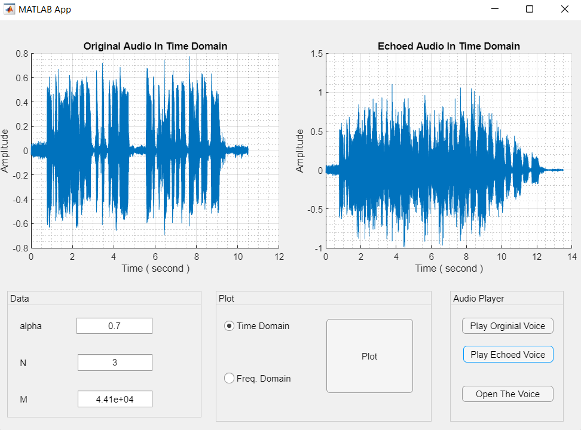

# DSP0_App-Designer-Project

---

## Question 1 : Plot frequency response of a system.

In this `app` you can add arbitrary pole(s) and zero(s) to the system and plot the frequency response of it.

   

---
---

## Question 2 : Echo simulator
Add `Echo` to an audio signal and plot both in time domain.

   

   

---

---

## Question 3 : Scrambling an audio signal and recovering it.

  

  

  

---

